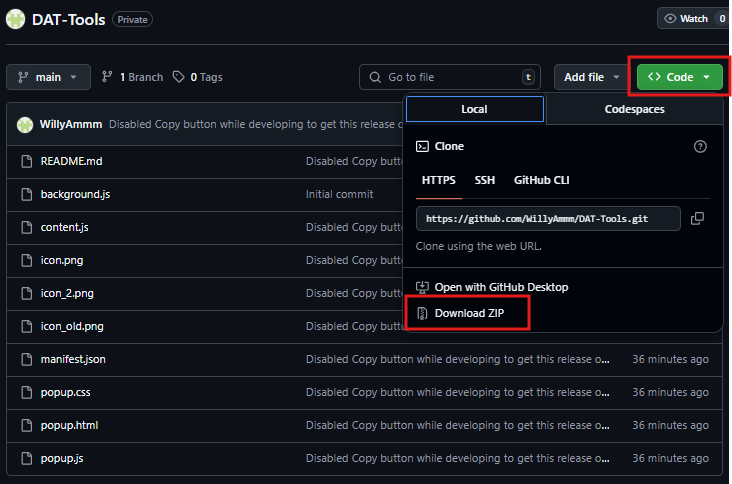
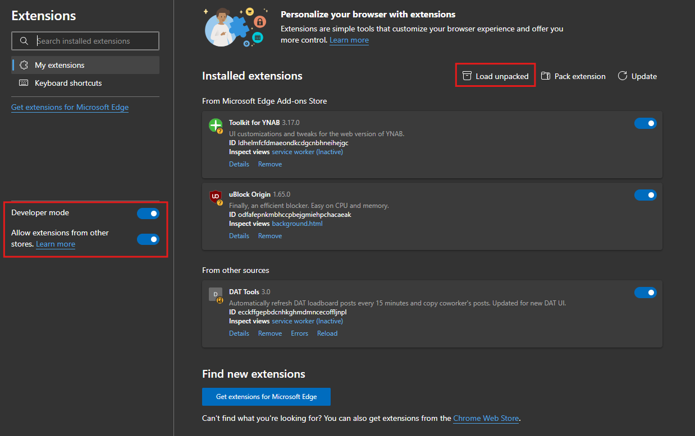
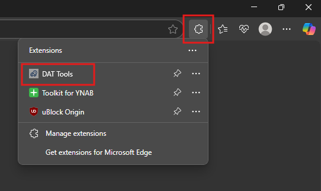

# DAT Auto Refresh

A simple browser extension that automatically refreshes DAT load board pages on a custom interval. Built to solve DAT's frustrating timeout behavior by keeping your session alive and your load board fresh. Feature to copy coworkers' posts in development.

## ⚙️ Features

- Auto-refreshes DAT load board every 15 minutes and 30 seconds
- Clean popup UI with start/stop toggle, timer, and refresh count
- Works with both Chrome and Edge
- Lightweight — no tracking, no login credentials needed or saved

## 🧱 File Structure

```
background.js   # Manages alarms, state, and communication for timed refresh logic  
content.js      # Executes in-page refresh logic and coworker post copying via DOM manipulation  
manifest.json   # Declares extension metadata, permissions, scripts, and entry points  
popup.html      # Extension popup layout and structure  
popup.css       # Styles the popup interface and supports light/dark themes  
popup.js        # Handles popup UI logic, refresh toggles, timers, and dark mode  
icon.png        # Extension icon used in the browser toolbar and notifications   
```

## 🚀 Installation - Install in Chrome / Edge

1. **Download this repo** to your local machine by clicking the green **Code** button and selecting **Download ZIP**:

   

2. Extract the downloaded ZIP folder on your PC by right clicking and selecting Extract All and then Extract.

3. Open your browser and go to:
   - Chrome: `chrome://extensions/`
   - Edge: `edge://extensions/`

4. Enable **"Developer Mode"** and **"Allow extensions from other stores"**, then click **"Load unpacked"**:

   

5. Select the extracted folder where these files live — the folder containing `manifest.json`, **not** the folder that only contains another folder.

6. Done! You should now see the **DAT Auto Refresh** icon in your extensions bar.

7. BE SURE TO RESTART YOUR BROWSER AFTER ADDING THE EXTENSION OR IT WON'T WORK!

---

## 🔁 How It Works

Once installed:
- Navigate to your DAT **My Shipments** tab
- Click the DAT Auto Refresh extension icon to open the popup:

  

- Click **Start**
- The script will now auto-refresh your posts every 15 minutes and 30 seconds

Still refreshes when on a different tab or if browser is minimized. DAT tab must stay on 'My Shipments' to refresh.

If you close or restart the browser, you’ll need to start the timer again manually.

---

## 🛠️ Customization

Users can toggle dark mode on or off

## 💬 Known Issues

- Will refresh all posts listed on screen. If you're looking at other user's posts through Workgroup Shipments, those will be refreshed as well. This is NOT a bug and is intended so the user can refresh their team's posts if necessary.

## 🧪 Coming Soon (maybe)

- Function to copy coworker's posts